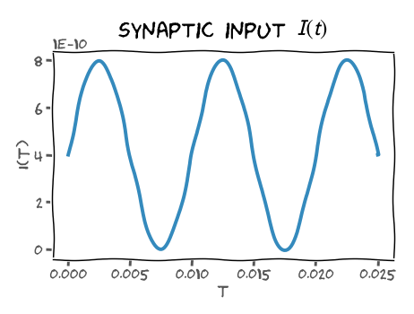

# チュートリアル：LIFニューロン Part1

**第0週 1日目：Python Workshow 1**

**By Neuromatch Academy**

**コンテンツ作成者：** Marco Brigham and the [CCNSS](https://www.ccnss.org/) team

**コンテンツレビュアー：** Michael Waskom, Karolina Stosio, Spiros Chavlis

**エディター：** Ella Batty, Spiros Chavlis

## チュートリアルの目標

NMAでは、対話的な（そして、できれば楽しい）方法で計算神経科学を学ぶためにコードを使用します。このチュートリアルと次のチュートリアルは、コース前にPythonについて早めに理解するためのもので、コース中は計算神経科学の概念に焦点を当てることができます。

この章では、Pythonの変数、制御フロー、プロッティングの基本操作を練習し、Pythonの科学計算の主力である`np.array`について確認します。

Pythonの新しい概念ごとに、Leaky Integrate-and-Fire (LIF) ニューロンの実装の異なる側面を学びます。そしてさらに良いことに、その膜電位の時間経過による変化を可視化し、その統計的特性を抽出します！

## セットアップ

### インストール

```python
import numpy as np
import matplotlib.pyplot as plt
```

## セクション1：Pythonの基礎とLIFモデル

### ビデオ1：Pythonの基礎とLIFモデル

<YouTube id="Bwm6rjRpVw8" />

### セクション1.1：LIFモデル

leaky-integrate-and-fire (LIF) ニューロンは、以下のような膜電位に関する方程式と初期化条件によって定義されます。

$$
\begin{align}
\tau_m\,\frac{d}{dt}\,V(t) &= E_{L} - V(t) + R\,I(t) &\text{if }\quad V(t) \leq V_{th} \\ \\
V(t) &= V_{reset} &\text{otherwise}
\end{align}
$$

ここで、$V(t)$は膜電位、$\tau_m$は膜の時定数、$E_{L}$はリーク電位、$R$は膜抵抗、$I(t)$はシナプス入力電流、$V_{th}$は発火閾値、$V_{reset}$はリセット電圧を示します。また、膜電位については$V_m$とも書くことができ、これはプロットのラベルに便利です。
膜方程式は、シナプス入力と細胞膜を越えた電荷のリークに対する膜電位$V(t)$の時間変化を記述します。これは普通の微分方程式（ODE）で、これについては今後詳しく学んでいきます。

::: warning
このチュートリアルでは、ニューロンモデルは発火メカニズムを実装しないことに注意してください。
:::

### セクション1.2：コード中のコメント

#### ビデオ2：コメントと文字列に関する簡単な振り返り

<YouTube id="UP8rD2AwceM" />

#### コーディング演習1：パラメーターを定義する

まず、LIFニューロンの主なシミュレーション変数を定義し、初期化します。

以下のコードセルで、シミュレーションパラメータを出力するようにコードを修正してください。

```python
# t_max = 150e-3   # second
# dt = 1e-3        # second
# tau = 20e-3      # second
# el = -60e-3      # milivolt
# vr = -70e-3      # milivolt
# vth = -50e-3     # milivolt
# r = 100e6        # ohm
# i_mean = 25e-11  # ampere

# print(t_max, dt, tau, el, vr, vth, r, i_mean)
```

**出力例**
```
0.15 0.001 0.02 -0.06 -0.07 -0.05 100000000.0 2.5e-10
```

それぞれの行の先頭の`#`を削除する必要がありました。そうしないと、コードはコメントとして読み取られ、実際には実行されません。コードを書くときには、デバッグのためにコードの一部を"コメントアウト"したい場合があるかもしれません。ここでは、数学的な記法に対応した説明的な変数名を使うようにしました。また、各行の末尾にコメントで単位を示しました。こうすることで、よりコードの意味を理解しやすくなります！

### セクション1.3：数学的操作

#### コーディング演習2：入力電流をシミュレーションする



私たちのモデルニューロンに入力されるシナプス入力$I(t)$をシミュレートする必要があります。まず、この入力をシミュレートするためにsinモデルから始めます（上図）。その方程式は以下の通りです：

$$
\begin{equation}
I(t)=I_{mean}\left(1+\sin\left(\frac{2 \pi}{0.01}\,t\right)\right)
\end{equation}
$$

ここで$I_{mean}$は平均電流入力で、{t}は時間です。

次のセルでは、$t=0$から$t=0.009$までの間のシナプス入力$I(t)$の値を計算します。ステップは$\Delta t=0.001$です。

**コーディング上の新しい概念**
- 以下のコードでは`for`ループを使用します。後で詳しく`for`ループについて説明しますが、基本的に`for`ループは同じコードブロックを複数回実行できます。この場合、ステップをループし、それぞれの回で変数`step`が新しい値となります。以下のような構文を使用します：
```python
for step in range(10):
```
これは、`step`が`0`から`9`までの各整数値を取ることを意味します。
- `np.pi`を$\pi$の値として使用し、`np.sin(x)`を使用することで`x`のsinの値を取得できます。これらは`numpy`というパッケージから来ており、後で詳しく説明します。

::: tip `range`関数
一般的に、`range`関数は、デフォルトで`0`から始まり、`1`ずつ増加し、指定した数の直前で止まる数列を返します。

**Syntax**
```python
range(start, stop, step) # range(2, 10, 2) -> [2, 4, 6, 8]
```
Parameters:
- `start`: オプショナル。どの位置から開始するかを指定する整数。デフォルトは`0`。
- `stop`: 必須。どの値で停止するを指定する整数（`stop`の値自体は結果に含まれません）。
- `step`: オプショナル。増加幅を指定する整数。デフォルトは`1`。
:::

```python
# Loop for 10 steps, variable 'step' takes values from 0 to 9
for step in range(10):

  # Compute value of t
  t = step * dt

  # Compute value of i at this time step
  i = ...

  # Print value of i
  print(i)
```

**出力例**
```
2.5e-10
3.969463130731183e-10
4.877641290737885e-10
4.877641290737885e-10
3.9694631307311837e-10
2.5000000000000007e-10
1.0305368692688176e-10
1.2235870926211617e-11
1.223587092621159e-11
1.0305368692688186e-10
```

### セクション1.4：フォーマット済み文字列リテラル

フォーマット済み文字列リテラルトは、シミュレーションパラメータをきれいで整理された形で表示するのに便利です。Python 3.6では、新たな文字列フォーマット`f-strings`が導入されました。私たちは浮動小数点型の変数を扱っているので、`x`を3桁の小数点までフォーマットするために`f'{x:.3f}'`を使用し、4桁の小数点までフォーマットするために指数表記の`f'{x:.4e}'`を使用します。

```python
x = 3.14159265e-1
print(f'{x:.3f}')
# --> 0.314

print(f'{x:.4e}')
# --> 3.1416e-01
```

### コーディング演習3：綺麗な数値の表示

前の演習と同様にループを使って、$t$の値を3桁の小数点、シナプス入力$I(t)$を指数表記の4桁の小数点で表示してください。

```python
# Initialize step_end
step_end = 10

# Loop for step_end steps
for step in range(step_end):

  # Compute value of t
  t = step * dt

  # Compute value of i at this time step
  i = i_mean * (1 + np.sin((t * 2 * np.pi) / 0.01))

  # Print value of t and i
  print(...)
```

**出力例**
```
0.000 2.5000e-10
0.001 3.9695e-10
0.002 4.8776e-10
0.003 4.8776e-10
0.004 3.9695e-10
0.005 2.5000e-10
0.006 1.0305e-10
0.007 1.2236e-11
0.008 1.2236e-11
0.009 1.0305e-10
```

::: details 回答
```python
# Initialize step_end
step_end = 10

# Loop for step_end steps
for step in range(step_end):

  # Compute value of t
  t = step * dt

  # Compute value of i at this time step
  i = i_mean * (1 + np.sin((t * 2 * np.pi) / 0.01))

  # Print value of t and i
  print(f'{t:.3f} {i:.4e}')
```
:::

## セクション2：`for`ループと離散時間積分

### ビデオ3：`for`ループと離散時間積分

<YouTube id="JkxgotYwu4Q" />

### セクション2.1：`for`ループ

`for`ループは、インデントされたコードブロックを複数回実行します（ループする変数は毎回新しい値になります）。以下の3つの形式はすべて同等であり、3回分ステップをループします：

```python
# 1
for step in [0, 1, 2]:
  print(step)

# 2
for step in range(3):
  print(step)

# 3
start = 0
end = 3
stepsize = 1

for step in range(start, end, stepsize):
  print(step)
```

### セクション2.2：スパイクによる離散時間積分

#### ビデオ4：離散時間積分の簡単な振り返り

<YouTube id="kyCbeR28AYQ" />
